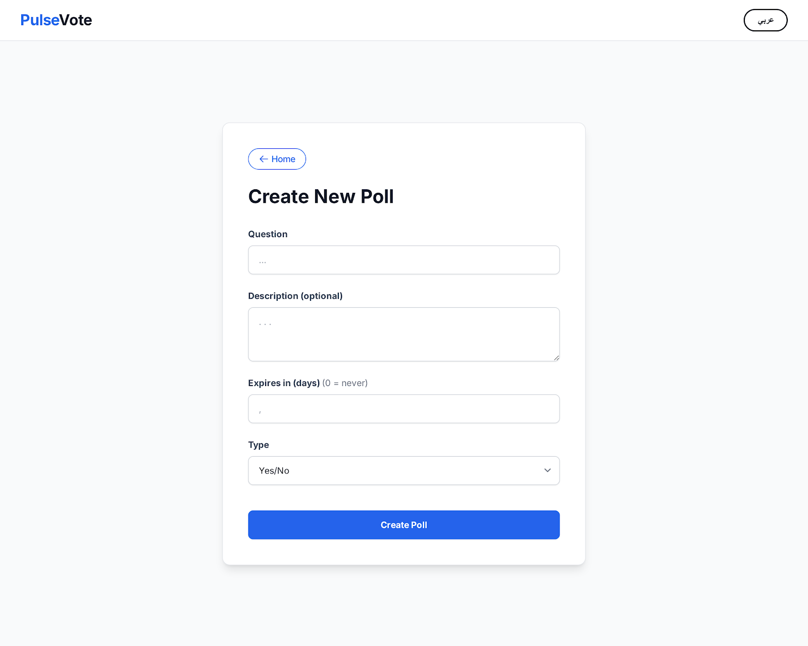

# PulseVote 🗳️



PulseVote is a lightweight web application for creating polls and collecting votes in real time.

The project is designed as a simple and clean voting system that demonstrates my skills in web application development and backend integration.

## 🚀 Live Demo

## ✨ Features

- Personal portfolio page with skills and projects showcase
- Create polls easily (Yes/No, Choice, Emoji, Stars)
- Two-phase voting (Before / After) with live result bars
- Real-time voting updates via Supabase
- Bilingual support (English / العربية)
- CSV export of poll results
- Share via WhatsApp, Telegram, Facebook, X, Email
- Progressive Web App (PWA) — installable on mobile/desktop
- Clean and responsive user interface

## 🛠️ Technologies Used

- HTML / CSS / JavaScript (Vanilla)
- Supabase (Backend & Database)
- Progressive Web App (Service Worker + Manifest)

## 📂 Project Structure

```
index.html          → HTML structure
style.css           → All styles
app.js              → Application logic
sw.js               → Service Worker
manifest.webmanifest → PWA manifest
Cairo-Bold.ttf      → Arabic font
icon.png            → App icon
screenshot.png      → README screenshot
```

## 📌 Purpose of the Project

This project is part of my development portfolio and demonstrates my experience in building functional web applications, integrating databases, and deploying live applications.

It represents real-world use cases such as voting systems, surveys, and lightweight data collection platforms.

---

Developed by **Abdulatef Al Ghushaimi**
